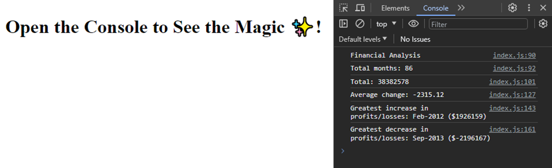

# Console-finances

## Description
  I was tasked to analyse the financial records of a company using the financial dataset and JavaScript Fundamentals. 

## Acceptance Criteria

- The total number of months included in the dataset.

- The net total amount of Profit/Losses over the entire period.

- The average of the changes in Profit/Losses over the entire period.

- The greatest increase in profits (date and amount) over the entire period.

- The greatest decrease in losses (date and amount) over the entire period.

## Screenshot

## License

MIT License